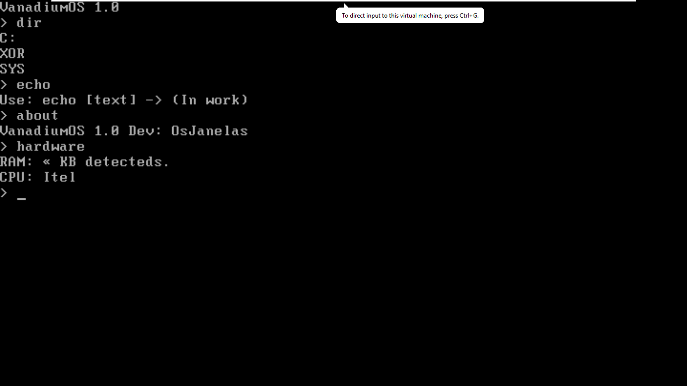
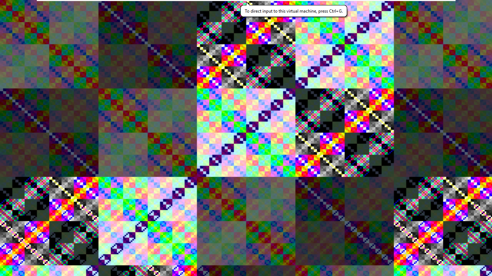

# VanadiumOS
VanadiumOS is a DOS made in Assembly :)

## Comands
"echo" shows a text, "about" shows about system, "hardware" shows a fake hardware, "dir" shows a directory, "hello" shows a xor fractal animation

